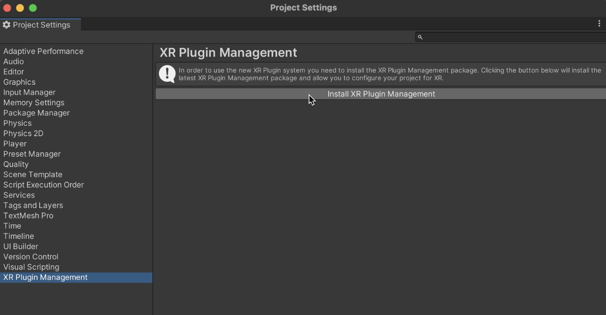

# UltraLeap Motion Controller 2 - Hand Tracking in Unity

This project demonstrates how to set up UltraLeap (Leap Motion) hand tracking in Unity and implement a basic interaction, such as grabbing an object in a virtual environment.

## Table of Contents

1. [Getting Started](#getting-started)
   - [Prerequisites](#prerequisites)
   - [Installation](#installation)
2. [Setting up UltraLeap in Unity](#setting-up-ultraleap-in-unity)
   - [Basic Configuration](#basic-configuration)
   - [Adding Hand Tracking to Your Scene](#adding-hand-tracking-to-your-scene)
4. [Basic Interaction: Grabbing an Object](#basic-interaction-grabbing-an-object)

---

## Getting Started

### Prerequisites

Make sure you have the following software and hardware:

- **Unity** (Latest version recommended, download from [Unity Download Page](https://unity.com/download))
- **UltraLeap Hand Tracking Device** (Download the latest tracking software from [UltraLeap Software Download](https://developer.leapmotion.com/tracking-software-download))

### Installation

1. **Download Unity Hub** from [Unity's website](https://unity.com/download).
2. **Install Unity** and make sure to select the build support options for your platform (PC, Android, etc.).
3. **Download and install** the **UltraLeap Hand Tracking Software** and connect your UltraLeap sensor.

## Setting up UltraLeap in Unity

#### NOTE: Ensure the orientation is set as `Desktop` after installing the UltraLeap Hand Tracking software.

### Basic Configuration
1. Set up the Unity XR Plugin Management Package, which can be installed from **Edit > Project Settings**.

 

2. Subsequently select the `Open XR` option.
3. Ensure that all the necessary fixes which may pop up are fixed through **Edit > Project Settings > XR Plugin Management > Project Validation**.

### Hand Tracking

##### Step 1: Add Ultraleap Scoped Registry

1. In Unity, go to **Edit -> Project Settings -> Package Manager**.
2. Add a new scoped registry with the following details:
   - **Name**: Ultraleap
   - **URL**: [https://package.openupm.com](https://package.openupm.com)
   - **Scope(s)**: `com.ultraleap`
  
 

##### Step 2: Open Package Manager

1. Open the **Package Manager** by navigating to **Window -> Package Manager**.
2. In the dropdown at the top left of the window, select **My Registries**.

 

##### Step 3: Install Ultraleap Tracking Package

1. In the list on the left, you should see **Ultraleap UPM packages**.
2. Find the **Ultraleap Tracking** package and select it.
3. Click **Install** in the bottom right corner.

 

##### Step 4: Include Example Content

1. To include sample content that demonstrates many features of the plugin:
   - Select **Samples** for the package in the Package Manager.
   - Import the samples as shown in the Package Manager interface.

 

  

##### Step 5: Test the Setup with Capsule Hands Scene

1. To ensure everything is set up correctly:
   - Open the **Capsule Hands** scene from the package samples. You can find it here:
     - `Assets > Samples > Ultraleap Tracking > x.x.x > Examples > 1. XR Examples > 2. Building Blocks > 1. Basics > 1. Capsule Hands.unity`
2. Press **Play** in Unity. You should now be able to see your hands tracking in the scene.

 

### Adding Hand Tracking to Your Scene

1. **Drag the Leap Rig prefab** from the `LeapMotion` folder into your scene.
2. The **Leap Rig** prefab includes everything needed for hand tracking (hand models, tracking camera, etc.).

3. **Position the Leap Rig** correctly relative to your main camera so that the UltraLeap device can track your hands accurately.

## Basic Interaction: Grabbing an Object

To allow interactions such as grabbing objects in your scene, follow these steps:

1. **Create a 3D object** (e.g., Cube) in your scene by going to **GameObject > 3D Object > Cube**.
2. Select the Cube, and add the **Interaction Behaviour** component:
   - Go to the **Inspector**, click **Add Component**, and search for **Interaction Behaviour**.
   - Check **Can Be Grasped** to make the object grabbable.

3. **Create an Interaction Manager**:
   - In the **Hierarchy**, create an empty GameObject named **InteractionManager**.
   - Add the **Interaction Manager** component by clicking **Add Component > Interaction Manager**.

4. **Test Interaction**:
   - Press **Play** in Unity.
   - Use your hands in front of the UltraLeap sensor to grab the Cube.

---
