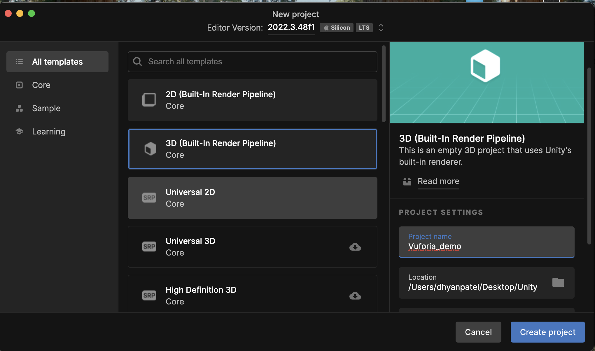

# AR Interactions

This tutorial illustrates the interaction between two AR objects and their behaviour upon contact. Please ensure you have Unity and Vuforia installed before you dive into this tutorial. 
This tutorial guides you through setting up an augmented reality environment using Unity and Vuforia to create a collision simulation between two 3D models representing cars.

## Unity Project Setup

- Open [Vuforia Download SDK](https://developer.vuforia.com/downloads/sdk) and download the Vuforia Engine to Unity Project.
  
- To allow Unity to recognize images/3D models using the laptop camera and track and display virtual objects on these images, we will import the Vuforia Unity Package. To do this, we will navigate to Assets/Import Packages/Custom Packages at the top of the menu toolbar.

Here is a more detailed explanation of each step:

1. Open Unity.




2. In the menu toolbar, navigate to Assets > Import Packages > Custom Packages.


3. In the Import Package dialog, select the Vuforia Unity Package and click Import.


4. Unity will import the Vuforia Unity Package and add the Vuforia namespace to your project.
5. You can now use the Vuforia API to recognize images/3D models using the laptop camera and track and display virtual objects on these images.


### Vuforia AR Camera Set Up

1. In the menu toolbar, navigate to GameObject > Vuforia > AR Camera.


2. Rename the camera to "Vuforia_ARCamera" for better identification. Delete the other 2 objects "AR Session" & "AR Session Origin"


3. Navigate to Assets > Resources > Vuforia Configuration, Add Vuforia License Key


#### Target Management

- This step is crucial since target management helps the Vuforia Engine identify the target image. 

1. Right-click under "SampleScene" and navigate to Vuforia Engine > Target Image.


2. Right-click on the newly created "ImageTarget" and navigate to 3D Object > Quad or add a ready asset.


## Vuforia ImageTarget and Collider Setup

1. Let's first create and add the `ImageTarget`.

2. Select the first `ImageTarget` added to the Hierarchy and drag the first of the two 3D models onto the `ImageTarget`, making it a child of the `ImageTarget`.

3. Select the game object instance containing the 3D model and add a `RigidBody` component, ensuring to set `Use Gravity` to `False` and `Is Kinematic` to `True`.


4. Within the 3D model, identify the child game object associated with the `Mesh Renderer` component. Add both `BoxCollider` and `CapsuleCollider` components to this child game object, setting the `IsTrigger` option to `True`.


5. Once this is done, you have to create a smoke or flame effect to simulate the impact; even if exaggerated, it is ultimately a game, so either you build it yourself with the Particle System, or you get a free one available on the Unity Asset Store.

6. As you will certainly have noticed, the figure also shows a component called ColliderManager, which is the script you need to create to manage the collision; then create a CSharp script and paste the following code into it.

```csharp
   using System.Collections;
   using System.Collections.Generic;
   using UnityEngine;

   public class ColliderManager : MonoBehaviour
   {
       private static ParticleSystem fireFront;
       private static ParticleSystem fireBack;

       void Start ()
       {
           fireFront = GameObject.FindGameObjectWithTag("FireFrontA").GetComponent<ParticleSystem>();
           fireBack = GameObject.FindGameObjectWithTag("FireBackA").GetComponent<ParticleSystem>();
       }

       void OnTriggerEnter(Collider other)
       {
           if (other is BoxCollider)
           {
               fireFront.Play(true);
           }
           else if (other is CapsuleCollider)
           {
               fireBack.Play(true);
           }
       }
   }
```
- In the `Start()` method, the private variables `FireFront` and `FireBack` are assigned to two effect instances using `GameObject.FindGameObjectWithTag("FireFrontA").GetComponent<ParticleSystem>()`. For simplicity, tags are utilized, necessitating the creation of `FireFrontA` and `FireBackA` tags, which should be associated with the game objects containing the explosion effects. Note that in augmented reality, the collider is triggered by the 3D model displayed by Vuforia, not the physical target held in hand.

- Within the `OnTriggerEnter()` event, a check is performed to identify the intercepted collider and execute the corresponding effect.

- Conversely, the `OnTriggerExit()` event is triggered when a vehicle ceases to touch the other car's collider, containing instructions to halt the effects if they are ongoing.

## Conclusion

- Assuming all preceding steps have been accurately followed, upon pressing the play button and upon camera recognition of the objects, their respective 3D models will appear. As you manoeuvre them closer and induce a collision.


#### Thank you for completing this tutorial! We hope you have gained a deeper understanding of handling collisions in augmented reality using Unity and Vuforia. Your engagement and effort in following through with the steps are highly appreciated.
